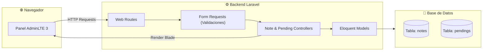
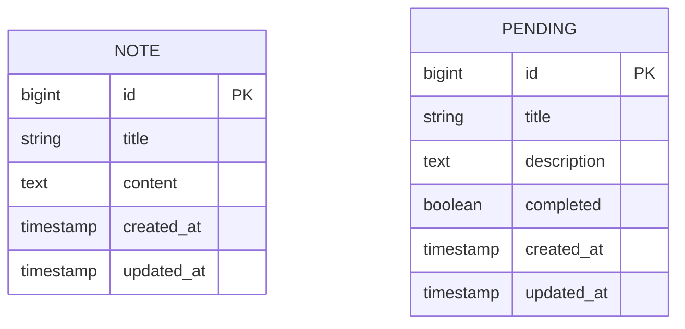

<div align="center">

# 📝 Notas y Pendientes — Panel de Gestión en Laravel

[](https://github.com/Matydesousa/notas-pendientes/actions/workflows/laravel.yml)
[](https://www.php.net/)
[](https://laravel.com/)
[](https://adminlte.io/)
[](database/)
[](https://laravel.com/docs/pint)
[](LICENSE)

---

Aplicación web desarrollada en Laravel para administrar notas rápidas y tareas pendientes mediante un panel de control interactivo basado en AdminLTE.

</div>

## 📌 Descripción

El sistema implementa dos módulos CRUD independientes pero integrados bajo la misma interfaz administrativa, permitiendo crear, consultar, modificar y organizar notas y tareas, con control de estado (por cumplir / completadas) y filtros en tiempo real.

---

## 🚀 Arquitectura y Base de Datos



### 📊 Modelo de Datos (ER)



---

## ✨ Módulos y Funcionalidades

| Módulo | Funcionalidades | Rutas Principales |
| :--- | :--- | :--- |
| **📝 Gestión de Notas** | Alta, listado, edición y eliminación de anotaciones con validación de longitud mínima y obligatoriedad. | `/note` `(Resource)` |
| **✅ Tareas Pendientes** | CRUD completo de pendientes con descripción detallada y control de estado booleano. | `/pending` `(Resource)` |
| **🔄 Cambio Rápido de Estado** | Conmutación instantánea (*Toggle*) entre estado completado y pendiente con un solo clic. | `PATCH /pending/{id}/toggle` |
| **🔍 Filtros de Tareas** | Vistas dedicadas para filtrar exclusivamente tareas finalizadas o tareas por realizar. | `/pending/completed`<br>`/pending/pending` |
| **🛡️ Validaciones Robustas** | Form Requests dedicados para evitar inconsistencias o datos incompletos. | `NoteRequest`, `PendingRequest` |
| **🎨 Interfaz Adaptable** | Vistas Blade organizadas sobre la plantilla responsiva de **AdminLTE 3**. | `resources/views/AdminLte/` |

---

## 🛠️ Tecnologías y Estándares

- **PHP 8.3**: Tipado estricto, métodos modernos y sintaxis limpia.
- **Laravel**: Enrutamiento, validación con Form Requests, migraciones y ORM Eloquent.
- **SQLite / MySQL**: Base de datos relacional (configurada por defecto en SQLite para facilitar pruebas inmediatas).
- **AdminLTE 3**: Dashboard responsive con alertas, botones de acción y tablas dinámicas.
- **Laravel Pint**: Formateador de código con estándares PSR-12.
- **PHPUnit / Pest**: Suite de pruebas funcionales para cobertura completa de endpoints.

---

## 💻 Instalación y Puesta en Marcha

### Requisitos previos
- PHP 8.3 o superior
- Composer
- Extensiones PHP: `mbstring`, `pdo_sqlite` (o `pdo_mysql`), `curl`

### Pasos de instalación

```bash
# 1. Clonar el repositorio
git clone https://github.com/Matydesousa/notas-pendientes.git
cd notas-pendientes

# 2. Instalar dependencias de PHP
composer install

# 3. Configurar variables de entorno
cp .env.example .env
php artisan key:generate

# 4. Publicar recursos de AdminLTE
php artisan adminlte:install --only=assets --force

# 5. Crear la base de datos SQLite y ejecutar migraciones
php -r "file_exists('database/database.sqlite') || touch('database/database.sqlite');"
php artisan migrate

# 6. Iniciar el servidor de desarrollo
php artisan serve
```

La aplicación estará disponible en [http://127.0.0.1:8000](http://127.0.0.1:8000).

---

## 🧪 Pruebas y Calidad de Código

El repositorio cuenta con integración continua que valida las dependencias, el estilo de código y los casos de prueba:

```bash
# Ejecutar suite de pruebas funcionales (36 aserciones)
php artisan test

# Verificar el formato de código con Laravel Pint
vendor/bin/pint --test

# Auditoría de seguridad de dependencias
composer audit --locked
```

---

## 📂 Estructura del Proyecto

```text
notas-pendientes/
├── .github/workflows/       # Workflow de integración continua (Laravel CI)
├── app/
│   ├── Http/
│   │   ├── Controllers/     # NoteController y PendingController
│   │   └── Requests/        # FormRequests con reglas de validación
│   └── Models/              # Modelos Eloquent Note y Pending
├── database/
│   └── migrations/          # Esquema de tablas para notas y pendientes
├── resources/views/
│   └── AdminLte/            # Vistas Blade integradas con AdminLTE 3
├── tests/Feature/           # Pruebas funcionales automatizadas
├── LICENSE                  # Licencia MIT
└── README.md                # Documentación del proyecto
```

---

## 👤 Autor

Desarrollado por **[Matías Joaquín De Sousa](https://github.com/Matydesousa)**.

---

## 📄 Licencia

Este proyecto se distribuye bajo la licencia **[MIT](LICENSE)**.
